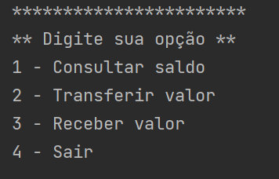

Desafio
Vamos implementar uma aplicação para controlar nossa conta bancária, seja ela virtual ou não.

🔨 Objetivos do projeto
Criar um cabeçalho inicial com os dados do cliente (Nome, Tipo da Conta e Saldo)
Criar um menu que descreve as operações. Aqui você pode escolher o nome de método que mais lhe agradar, como saca (ou transfere, enviaPix) para simular a retirada de valores da conta e deposita (ou recebeTransferencia, recebePix) para representar a entrada de valores na conta.
O menu deve ter quatro opções: a de entrada de valor, saída de valor, consulta de saldo e finalização da aplicação.
Lembre-se que para fazer a saída de valores, é necessário ter saldo suficiente.
O menu deve aparecer continuamente até que o usuário digite a opção para sair.
Caso ele digite qualquer opção que não seja correta, deve apresentar a mensagem de opção inválida.
Usaremos a classe Scanner para fazer a leitura da opção do usuário.
Exemplo/Sugestão de tela para o menu:

